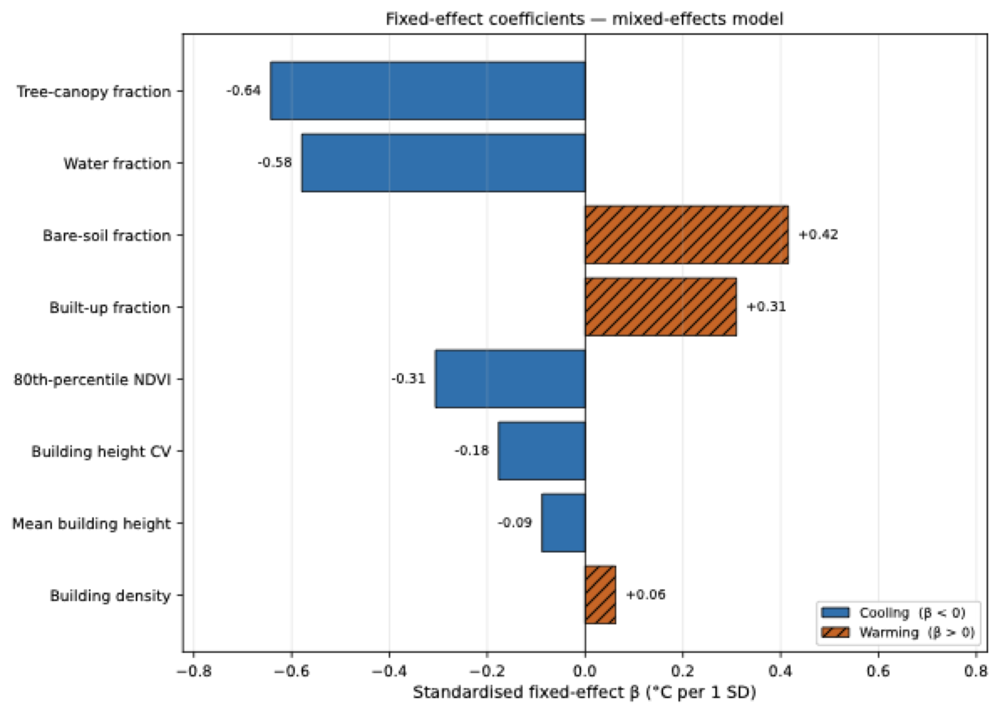
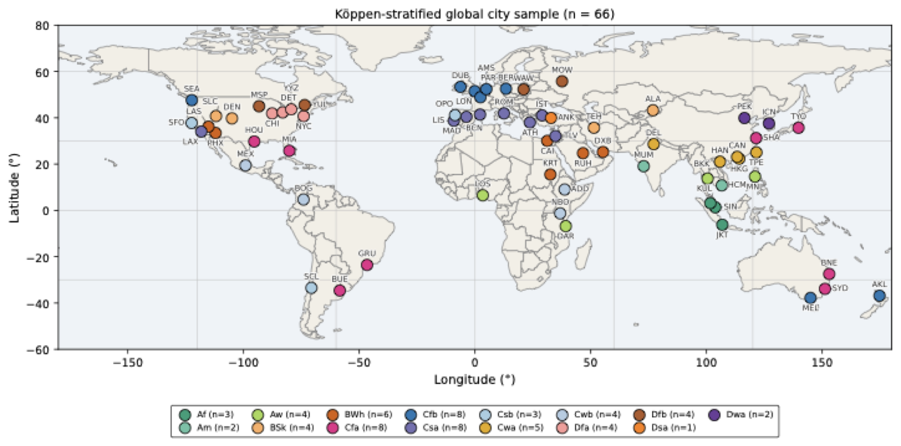
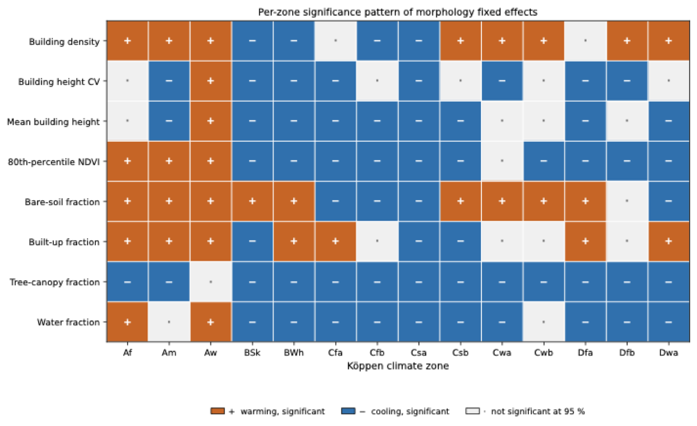
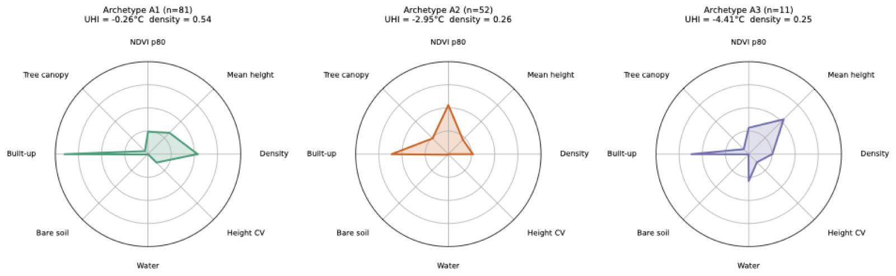

# Beyond Local Climate Zones — Continuous Morphology Archetypes for Heat Mitigation

[](https://doi.org/10.1016/j.scs.2026.107814)
[](https://doi.org/10.5281/zenodo.19897974)
[](https://opensource.org/licenses/MIT)
[](https://creativecommons.org/licenses/by/4.0/)
[](https://www.python.org/downloads/)

Companion code and data for the published article:

> **Emekci, S., & Emekci, H. (2026).** Beyond local climate zones: Continuous morphology
> archetypes for heat mitigation across 66 cities. *Sustainable Cities and Society*, **150**, 107814.
> https://doi.org/10.1016/j.scs.2026.107814

**Article:** [doi.org/10.1016/j.scs.2026.107814](https://doi.org/10.1016/j.scs.2026.107814) ·
**Archived release:** [doi.org/10.5281/zenodo.19897974](https://doi.org/10.5281/zenodo.19897974) ·
**Repository:** [github.com/hemekci/UHI](https://github.com/hemekci/UHI)

---

## How to cite

Please cite **the article** for the findings, and **the archived release** if you use the code
or the harmonised data table.

### Article

```bibtex
@article{emekci2026morphology,
  author  = {Emekci, Seyda and Emekci, Hakan},
  title   = {Beyond local climate zones: Continuous morphology archetypes for heat mitigation across 66 cities},
  journal = {Sustainable Cities and Society},
  year    = {2026},
  volume  = {150},
  pages   = {107814},
  doi     = {10.1016/j.scs.2026.107814}
}
```

### Software and data

```bibtex
@software{emekci2026uhi,
  author    = {Emekci, Seyda and Emekci, Hakan},
  title     = {{UHI}: Continuous Morphology Archetypes for Heat Mitigation Across Cities},
  year      = {2026},
  publisher = {Zenodo},
  doi       = {10.5281/zenodo.19897974},
  url       = {https://github.com/hemekci/UHI}
}
```

The Zenodo DOI above is a *concept* DOI: it always resolves to the most recent release.
To cite a specific version, use the version DOI shown on that release's Zenodo page.

GitHub's **Cite this repository** button (top right) produces the same entries from
[`CITATION.cff`](CITATION.cff).

---

## What this study does

Urban block morphology is fixed at masterplan stage and locks in thermal performance for
50–100 years, yet design-stage guidance has been derived city by city. This study measures
morphology **continuously** — rather than through categorical Local Climate Zone classes —
across a harmonised multi-city sample, and attributes surface urban heat island (SUHI)
variation to it within climate zones.

| | |
|---|---|
| **Cities** | 66, across 15 Köppen climate zones |
| **Sample** | 33,715 harmonised 1 km² patches (33,498 after a physical-plausibility screen) |
| **Target** | 3-summer rolling-mean Landsat 8/9 surface-temperature anomaly, within-city centred |
| **Morphology** | 8 continuous features from open global building-footprint-with-height products |
| **Models** | Linear mixed effects with city random intercept; XGBoost + SHAP for corroboration |
| **Outputs** | Per-zone coefficients, empirical Pareto fronts, three designer-facing archetypes |

### Headline results

- **Tree-canopy fraction is the only universal cooling lever** — negative in all 14 modelled
  zones and significant in 13 (β = −0.64, *p* < 10⁻¹²²).
- Morphology explains a **limited but consistent** share of within-city SUHI variance
  (marginal *R*² = 0.25, conditional *R*² = 0.39); background climate dominates, as expected.
- Per-zone models lift the pooled marginal *R*² to **0.38**, reaching 0.55 in Dwa.
- **144 Pareto-efficient patches** cluster into **three climate-smart archetypes**.

---

## Figures

Effect-size ranking of the morphology fixed effects:



Where the 66 cities sit across Köppen climate zones:



Which morphology features are significant in which zone:



The three climate-smart morphology archetypes:



All 15 figures are in [`docs/figures/`](docs/figures/).

---

## Repository layout

```
pipeline/     ingest → features → models → archetypes
configs/      Hydra configuration
scripts/      entry points for each pipeline stage
notebooks/    reproducibility notebooks
data/         data manifest (sources, licences, access instructions)
docs/figures/ all published figures as PNG
tests/        smoke tests
```

## Data sources

All inputs are public and open. The harmonised patch-level table is derived from
Landsat 8/9 Collection 2 Level 2 (USGS), Microsoft Global ML Building Footprints,
Google Open Buildings v3, the VIDA Google–Microsoft combined distribution,
GlobalBuildingAtlas, GLAMOUR, ESA WorldCover, ERA5-Land (ECMWF Copernicus),
WUDAPT LCZ and SRTM. Provenance, licences and access instructions for each layer are
in [`data/README.md`](data/README.md).

## Licence

Code is released under the [MIT licence](LICENSE). The harmonised data table and the
paper text are released under [CC BY 4.0](https://creativecommons.org/licenses/by/4.0/).

## Contact

**Seyda Emekci** (corresponding author) — Department of Architecture,
Ankara Yıldırım Beyazıt University, Ankara, Türkiye — semekci@aybu.edu.tr

**Hakan Emekci** — Institute of Informatics, Hacettepe University, Ankara, Türkiye

---

**Keywords:** urban heat island · urban morphology · surface urban heat island · SUHI ·
land surface temperature · Landsat · building footprints · building height · Local Climate Zones ·
LCZ · Köppen climate zones · mixed-effects models · XGBoost · SHAP · explainable machine learning ·
Pareto frontier · urban climate · climate-smart design · heat mitigation · multi-city study
